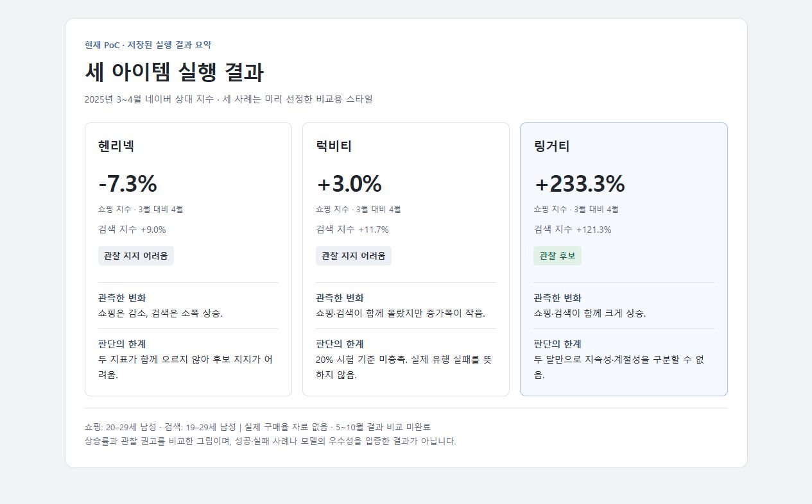
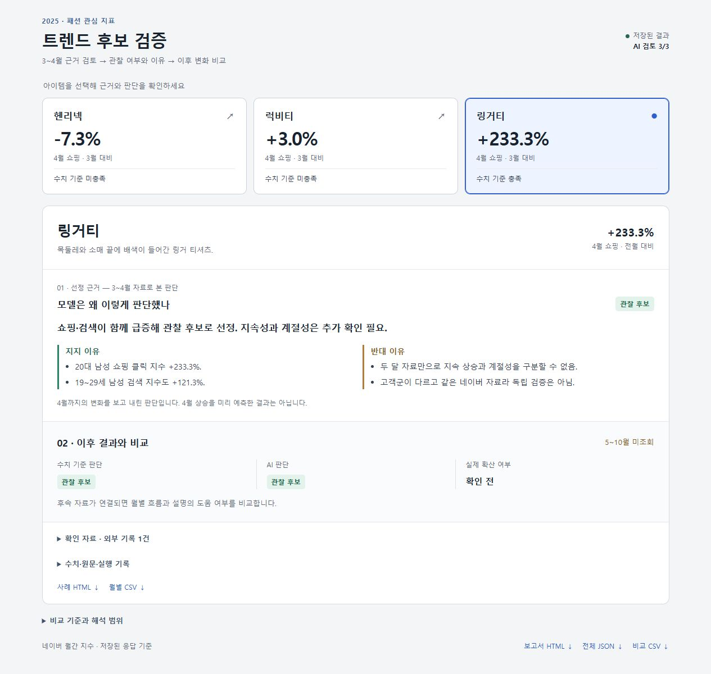
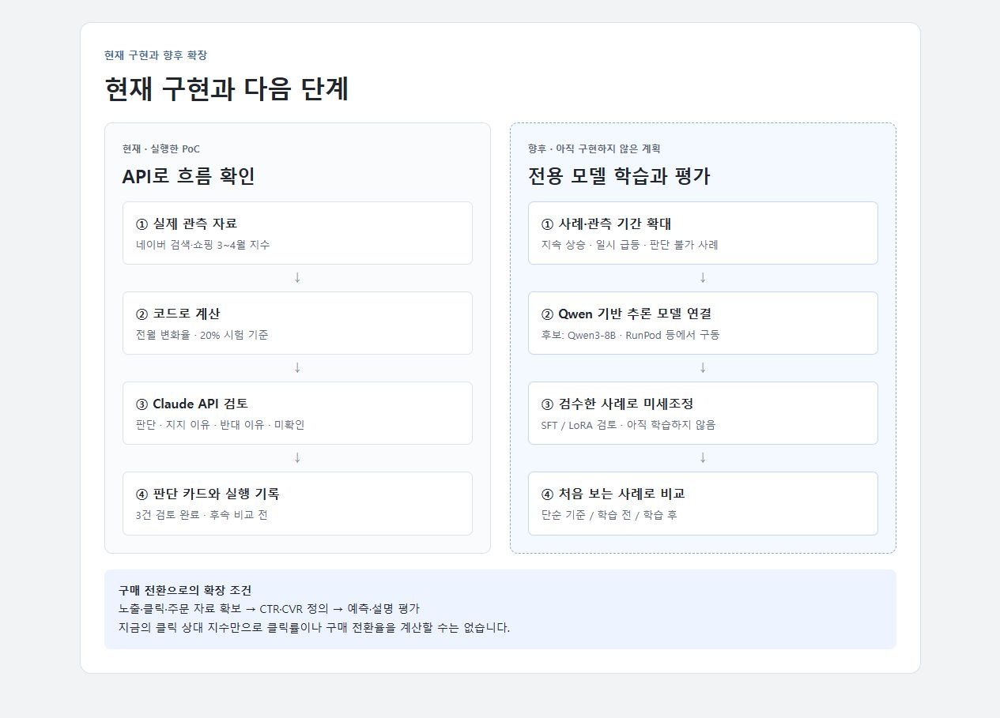

# 5주차 검증 파트

이번 주에는 수집한 자료를 모델에 넣고, 판단과 반대 이유가 화면에 나오는 데까지 연결했다. 전용 모델을 학습하기 전에 최종 결과물이 어떤 형태가 될지 확인하는 단계다.

## 실제 실행 결과

헨리넥·럭비티·링거티 세 개를 정해 2025년 3~4월 네이버 자료로 비교했다. 변화율은 3월 대비 4월 기준이다.

| 아이템 | 쇼핑 지수 변화 | 검색 지수 변화 | 모델 판단 |
| --- | ---: | ---: | --- |
| 헨리넥 | −7.3% | +9.0% | 관찰 지지 어려움 |
| 럭비티 | +3.0% | +11.7% | 관찰 지지 어려움 |
| 링거티 | +233.3% | +121.3% | 관찰 후보 |

이번 판단은 4월까지의 자료를 본 뒤 나온 것이다. 4월 상승을 미리 예측한 결과는 아니다.

헨리넥은 재실행을 완료했다. 검색은 조금 늘었지만 쇼핑 클릭이 줄어 관찰 후보를 지지하기 어렵다는 판단이다.

링거티는 검색·쇼핑이 함께 올라 관찰 후보로 남겼다. 다만 두 달 자료만으로 지속되는 상승인지, 계절적 변화인지는 알 수 없다는 반대 이유가 나왔다. 럭비티는 관심이 조금 올랐지만, 임시로 정한 쇼핑 20% 증가 기준에는 못 미쳤다.

쇼핑은 20–29세 남성, 검색은 19–29세 남성 자료다. 세 아이템은 비교를 위해 미리 정한 것이며, 실제 유행의 성공·실패로 나눈 사례는 아니다. 5~10월 후속 비교도 아직 하지 않았다.

## 지금은 어떻게 돌아가는가

**네이버 자료 → 코드로 증감률 계산 → Claude API 검토 → 판단 카드 저장**

API에는 수치와 조회 조건을 보내고, 관찰할 가치가 있는지와 그 이유를 받는다. 지지 이유와 반대 이유를 함께 저장하고, 원자료와 모델 응답도 다시 확인할 수 있게 했다. 화면의 문구는 저장된 응답을 짧게 정리한 것이며 원문은 따로 남겨뒀다.

현재는 우리 자료로 모델을 학습시킨 상태는 아니다. 또 코드의 판단과 자료의 한계도 입력에 들어가 있어, 나온 답이 기존 판단을 설명한 수준일 수 있다. 이 결과만으로 리즈닝이 효과가 있었다고 보지는 않는다.

## 최종적으로 만들려는 것

최종 목표는 상승한 아이템에 대해 여러 근거를 비교하고, 앞으로 관심이 이어질 이유와 그렇지 않을 이유를 설명하는 트렌드 전용 추론 모델이다.

Qwen 계열의 추론 모델을 먼저 연결하고, 검수한 사례가 쌓이면 미세조정을 검토할 예정이다. RunPod는 모델을 돌리는 환경으로 사용한다. 단순히 모델을 내려받는 것과 우리 자료로 판단 방식을 학습시키는 것은 구분한다.

현재 자료로는 관심 상승의 지속 여부부터 다룬다. 나중에 노출·클릭·주문 자료를 확보하면 클릭률이나 구매 전환율까지 학습 범위를 넓힐 수 있다. **지금의 쇼핑 클릭 지수만으로 실제 구매율이 증가했는지는 알 수 없다.**

## 다음에 확인할 것

- 후속 자료를 연결해 당시 판단과 이후 관심 변화를 비교
- 아이템과 관측 기간을 늘려 지속 상승·일시 급등·판단 불가 사례 정리
- 같은 근거로 단순 수치 기준과 추론 모델을 비교
- 검수한 사례가 쌓인 뒤 미세조정 전후 비교

## 코드 위치

- `src/trend_poc/monthly.py`: 수치 계산과 근거 구성
- `src/trend_poc/review.py`: 모델에 보내는 질문과 API 호출
- `src/trend_poc/monthly_dashboard.py`: 검증 화면
